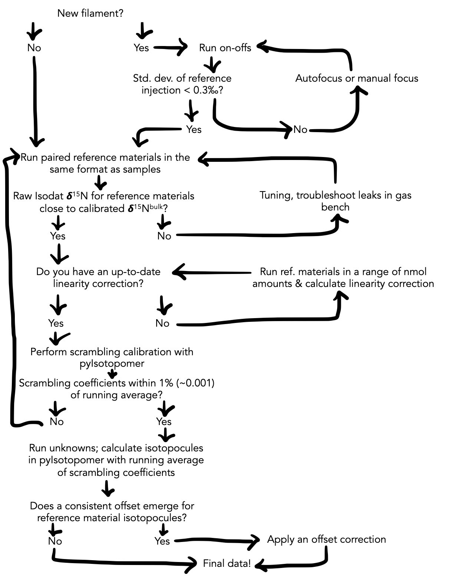

# m-isotopomer

Hello!

m-isotopomer is a MATLAB toolbox for processing nitrous oxide (N<sub>2</sub>O) isotopomer data. Its core is a package of scripts to correct for scrambling in the ion source during isotope ratio mass spectrometry. An alternate version of this package exists for [Python](https://github.com/ckelly314/pyisotopomer).

## Intro

While the scrambling calibration is an integral part of the N<sub>2</sub>O data processing, this calibration is part of a larger data processing pipeline. Below is a flowchart which illustrates the full suite of steps requisite to obtaining high-quality N<sub>2</sub>O  isotopocule data from isotope ratio mass spectrometry. The scrambling calibration and isotopocule calculation steps can be performed in m-isotopomer.



In this document, we will go over:

1. Correcting IRMS data for the effect of peak area on isotope ratios
2. Calibrating your instrument for scrambling with m-isotopomer
3. Calculating isotopomers with m-isotopomer

## Size correction

Export IRMS data in Isodat, with separate export templates for the sample peak and designated reference peak for each sample.

Open the .xls file containing Isodat output. Note that the spreadsheet contains two tabs: one contains raw data for each sample, and the other contains raw data for the designated reference peak for each sample.

In the "sample" tab, bring all fragment data in line, then delete extra rows. Do the same in the "standard" tab.

Open the data correction template "00_excel_template.xlsx". Copy the raw sample data from columns A-O in the sample tab into columns B-P in the correction template. Copy the "rR" columns from the standards tab (columns M, N, O) into columns R, S, T in the correction template. Save the correction template with a new name.

Replace the values in row 3, columns V-X with the appropriate 31R, 45R, and 46R for your N<sub>2</sub>O reference gas (the reference gas used for on-offs/direct injections). The values in the template spreadsheet are specific to the Casciotti Lab's N<sub>2</sub>O reference gas. 

Replace the values in row 7, columns V-X, with your size correction slopes. Ensure that these size correction slopes are normalized to the m/z 44 peak area. Ensure that they apply to the raw "ratio of ratios" 31rR/31rR, 45rR/45rR, and 45rR/45rR in columns Z-AB. The values in the template spreadsheet are specific to the linearity of the Casciotti Lab Delta V, as of February-March 2021.

The 31R, 45R, and 46R for each sample, normalized to the common reference injection and normalized to a m/z 44 peak area of 20 Vs, are found in columns AH-AJ.

## Calibrating your instrument for scrambling with m-isotopomer:

Here, two coefficients, γ and κ, are used to describe scrambling in the ion source. This is described in further detail in [Frame and Casciotti, 2010](https://www.biogeosciences.net/7/2695/2010/). Below is a description of how to calculate these coefficients in m-isotopomer.

Run two reference gases with known 15R-alpha and 15R-beta, prepared in the same format as samples (i.e., some amount of N<sub>2</sub>O reference gas injected into a bottle of seawater or DI water that has been purged with He or N2 gas). Export and size-correct these data in the excel correction template, as above. The placeholder samples in the template spreadsheet are arranged in the right order 1-7, but this may not necessarily be the case, depending on how one performs step 2 above. The order is not important to what follows, as long as the samples (columns B-P) and reference peaks (columns R-T) are in the same order.

From the correction template, copy and paste the size-corrected 31R, 45R, and 46R (columns AH, AI, AJ) from the size_correction tab into the scrambling_template tab, columns C-E. 

Reorganize the size corrected data into pairs of reference materials by copy-pasting into columns H-M of the scrambling input template. The columns should be in the following order: 31R, 45R, 46R for reference #1, then 31R, 45R, 46R for reference #2. If there are three sets of standards, break them into three different pairings to feed into m-isotopomer.

Copy and paste columns H-M in the scrambling input template into their own .csv file, with no heading. Delete blank rows. Save the .csv file into the m-isotopomer directory. Note that it is important to save as the simple “comma-separated values (.csv)” file format. More complicated versions of the .csv format, such as CSV UTF-8, will not work.

Open ```constants.m```. Note that we specify a dictionary of reference materials in lines 28-32. If the reference materials used to calibrate scrambling are not in this dictionary, add them, following the format of the existing lines. 

Open ```automate_gk_setinputs.m```. Change line 21 to reflect your input filename. This should read something like:

```MATLAB
inputfilename = 'example_atm_s2.csv';
```

Change line 26 to reflect what you would like the output filename to be. This should read something like:

```MATLAB
outputfilename = 'example_atm_s2_output.txt';
```

Change lines 30 and 31 to reflect the two reference materials you will use to calibrate scrambling. This should read something like:

```MATLAB
ref1 = 'ATM';
ref2 = 'S2';
```

Run ```automate_gk_setinputs.m```.

Open your output file and copy-paste the two columns back into the scrambling input template. The first column will be the gamma values and the second column will be the kappa values for each pair of samples. These should all be quite similar.

## Calculating isotopomers with m-isotopomer

Size-correct your data (including all samples and standards), as above. Copy and paste columns AH, AI, and AJ (size corrected R’s) into a separate spreadsheet, making sure to ‘paste special’, ‘values’. This will become your input file. Make sure your data columns are in the following order: 31R, 45R, 46R, then remove the headings. Save input file in .csv format, e.g. example_isotopomer_input.csv, into the m-isotopomer directory. 

Open ```N2OSPcalcs.m``` in Matlab. Enter your input file name on line 21. It should read something like: 

```MATLAB
inputfilename = 'example_input.csv';
```

Enter your desired output file name on line 27. This will overwrite any existing file with the same name, so be sure to change the output file name each time. It should read something like:

```MATLAB
outputfilename = 'example_output.txt';
```

Finally, modify line 33 to reflect the most appropriate scrambling coefficients for this set of samples (see below). It should read something like:

```MATLAB
gamma_kappa = [0.171 0.079];
```

### How to think about scrambling when calculating isotopomers

You will also need to enter the appropriate scrambling coefficients in the call to  ```N2OSPcalcs.m```. These scrambling coefficients should represent a running average of γ and κ calculated from at least 10 pairings of reference materials (e.g. a week's worth, if unknowns are bookended by reference materials) run alongside unknowns. 

The scrambling coefficients should not be those calculated alongside one run of unknowns. This is because a 1% standard deviation in the scrambling coefficients leads to an error of ~4‰ in site preference, so it is advisable to run sufficient reference materials to bring the standard deviation of γ and κ below this threshold.

### __

Run ```N2OSPcalcs.m```.

Open your output file (example_output.txt in this example). Output data contains columns in the following order: d15Nalpha, d15Nbeta, 15N site pref, d15Nbulk, d17O, d18O. Copy and paste output data back into working spreadsheet in olive-highlighted cells (columns AM-AR).

Note that a scale decompression may be applied after the isotopomer calculation. This is calculated in the “scale-decompression” tab of the excel worksheet, and is applied in columns AU-AZ of the size_correction tab. The scale decompression should be applied as an average 

## Calculating concentrations of <sup>44</sup>N<sub>2</sub>O, <sup>45</sup>N<sub>2</sub>O-α, <sup>45</sup>N<sub>2</sub>O-β, and <sup>46</sup>N<sub>2</sub>O

Calculate the amount (nmol) of <sup>44</sup>N<sub>2</sub>O in your sample from the ratio of mass 44 peak area to N<sub>2</sub>O (nmol/Vs) for your instrument. For high levels of <sup>15</sup>N enrichment, account for masses 45 and 46 as well when calculating the total N<sub>2</sub>O.

Use the weight difference of the bottle pre- and post-analysis to determine the volume of sample run, and thus the concentration of <sup>44</sup>N<sub>2</sub>O.

We calculate the concentrations of <sup>45</sup>N<sub>2</sub>O-α, <sup>45</sup>N<sub>2</sub>O-β, and <sup>46</sup>N<sub>2</sub>O (for tracer experiments) from the delta value and associated 15/14 ratios. For high levels of <sup>15</sup>N enrichment, use atom fraction <sup>15</sup>N and 14</sup>N rather than isotope ratios.
